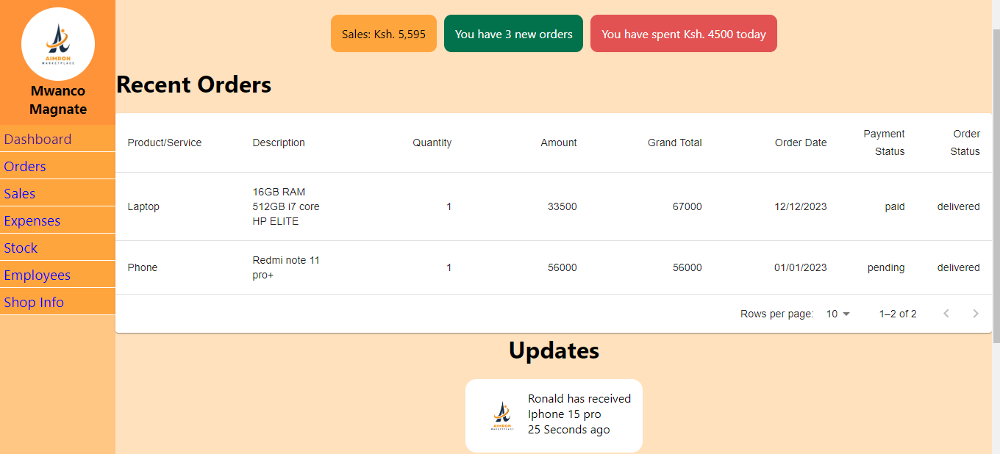

# Aimron Marketplace

# LINK TO THE DEPLOYED SITE WILL BE AVAILABLE SOON

Aimron Marketplace is an ecommerce that connects buyers to sellers. It offers buyers features such as; setting monthly expenditure goals, enables them to manage all their finances and also gives them the ability to set shopping list.Sellers get features such as stock management and a dedicated webpage for their products.

# Features

## Buyers Features

The buyers will enjoy the following features

### Setting Monthly Goals

The marketplace enables you to set your monthly expenditure and visualizes the how much you have spent and how much is remaining to hit the target in good looking charts

### Tracking their expenses

They will be able to track all your purchases including all their details.

### Managing their expenses

We give you the ability to keep a record of your expenditure aside the purchases and this enables proper account of all your money

### Ability to set shopping list

This is a feature that enables you to set a shopping list of items you would like to buy. You will be able to make purchase from the shopping list in a click of a button

## Sellers Features

The sellers accounts will have the following features

### Dashboard

This page nicely summarises all your shops activities for the last 24 hours.

### Orders

This page will contain all orders that ave ever been placed enabling you to keep track of the orders and do deliveries effectively

### Sales

In this page there will be a summary of all te sales you have made and profit made.

### Expenses

In this page, you'll get to see all the shop's expenses and also be able to add any other expenses

### Employees

This page will have all the shop's emloyees information, their deatils and their pay day. The seller who is the owner of the shop will get a reminder of the employees pay day.

# About Developer

My name is Ronald Mutua. This projects was inspired by the need of a way to manage stock and my brother's shop. I saw that, this problem could be solved by creating this project and that's why I did it.
